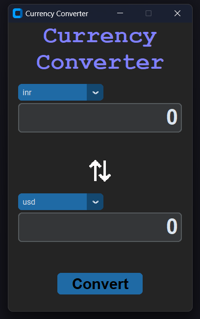

# Currency Converter GUI

This is a class based GUI-based currency converter built using `customtkinter` and Python. The application allows users to convert between various currencies using real-time exchange rates.

## Features

- User-friendly GUI made with `customtkinter`
- Converts between multiple currencies
- Real-time exchange rate updates
- Error handling for invalid inputs
- Reusable Widgets
- Easily Manageable Code

## Screenshots



## Requirements

- Python 3.x
- `customtkinter` library
- `requests` library (for fetching real-time exchange rates)

## Acknowledgments

I would like to thank the following individuals and projects for their contributions and support:

- **[CustomTkinter](https://github.com/TomSchimansky/CustomTkinter)**: For providing the `customtkinter` library used to create the GUI.
- **[ExchangeRate-API](https://github.com/fawazahmed0/)**: For providing the real-time exchange rate API used in this application.

Your contributions and hard work are greatly appreciated!

## Installation

1. Clone the repository:

```bash
git clone https://github.com/yourusername/currency-converter-gui.git
cd currency-converter
```

- ### `If using python virtual environment `

2. **Create Virtual Environment and Install the required dependencies:**

   ```sh
   python -m venv .venv
   ./venv/Script/activate
   ```

3. **Install the required dependencies:**

   ```sh
   pip install -r requirements.txt
   ```

4. **Run the game:**
   ```sh
   python main.py
   ```
